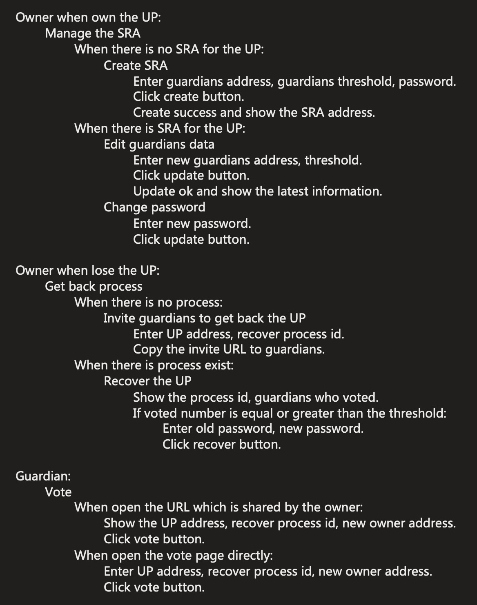
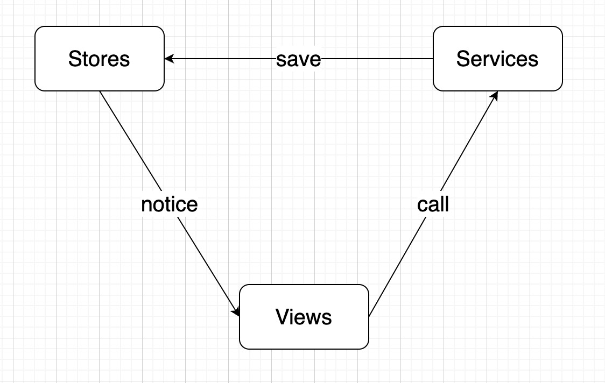

# universalprofile-social-recovery-tool

## [Demo Video](https://www.youtube.com/watch?v=yEDvm_-IWDU)

## Dependency
This tool depends on social recovery contract, it's in submodule lib/lsp-smart-contracts, you need:
```
git submodule init
git submodule update
```

## Architecture

### use case


### data flow


## Project setup

```
npm install
```

### Compiles and hot-reloads for development

```
npm run serve
```

### Compiles and minifies for production

```
npm run build
```

## Contact

- Wei Yao <btwyao@foxmail.com>